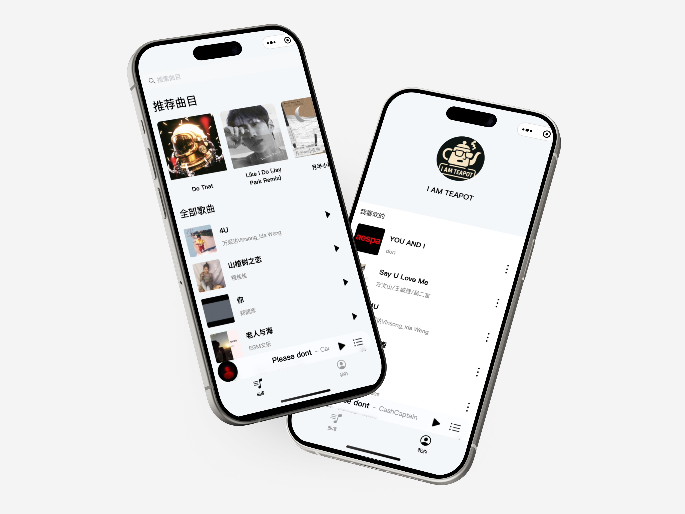

## 项目简介

该项目是 HDU（杭州电子科技大学）「软件开发实践 3 」的短学期课程项目。项目的目标是开发一款仿**网易云音乐**的微信小程序。

### 项目效果图展示

> 总体界面展示


> 播放器界面（毛玻璃专辑封面背景 + 自动滚动歌词）


> 核心界面（曲库 + 我的）



### 前端技术栈

- 框架：使用 Taro 结合 React 进行开发
- 组件库：[Taroify](https://taroify.github.io/taroify.com/introduce/)
- 全局状态管理：使用 zustand 管理全局状态，同时结合了 zustand 的 `persist` 中间件实现了用户信息的本地缓存

### Taro 项目配置

| 选项                | 选择     |
| ------------------- | -------- |
| 框架                | React    |
| 是否使用 TypeScript | 是       |
| 是否编译为 ES5？    | 否       |
| CSS 预处理器        | Sass     |
| 包管理工具          | npm      |
| 编译工具            | Webpack5 |
| 模版源              | Gitee    |
| 模版                | 默认模版 |

### 后端简介

- 数据库：MySQL
- 框架：Spring Boot
- 持久层框架：MyBatis

## 运行项目

在成功克隆代码之后，可以开始尝试在你本地的环境运行项目。

### 安装依赖

首先，使用 npm 全局安装 CLI

```bash
npm install -g @tarojs/cli
```

运行该指令，安装项目依赖

```bash
npm install
```

### 编译项目

首先，在 terminal 中运行该指令：

```bash
npm run dev:weapp
```

> 可能出现的报错：如果文件夹权限是只读，可能会出现报错；要给文件夹赋予可执行权限。

如果编译成功，项目文件夹下会生成一个 dist 文件夹。

### 启动模拟器

在微信开发者工具中，选择【导入】项目，打开项目的 dist 文件夹。

如果能正常打开的话，就能够在编写代码的时候实时预览界面；同时能在 Console 中进行调试。

## 如何协作开发

本项目使用【本地 Git】+【远程 GitHub】进行代码的管理和同步。下文会对一些关键操作进行解释，具体的细节请自行查阅资料 / 问 AI。

> Git 是一个很实用且功能丰富的工具，如果之前没有使用过，建议在开发过程中边做边找解决方法，这样效率更高

### 初始化

1. 将该项目 Fork 到自己的代码仓库
2. 将你仓库中的代码 Clone 到本地

**Source Control**

如果使用 VS Code，可以使用 Source Control 中的「Clone Repository」，然后输入你代码仓库的 URL 即可，比较方便

**命令行**

或者直接使用命令行把代码拉下来。你需要把这段脚本中的用户名和仓库名替换成自己的：

```bash
git clone https://github.com/your-username/the-repo-name.git
cd the-repo-name
code .
```

### 贡献代码

每个人负责自己模块的开发，尽量不要同时改动全局的文件，不然冲突难处理。如果实在遇到了这种问题，及时在群里沟通。

在开发过程中，尽量遵循以下规则，提高团队开发效率：

**commit 原子化**

在本地开发的过程中，多提交 commit；提交信息尽量简明扼要。commit 的格式遵循以下规范：

| 类型       | 用途                       | 示例                     |
| ---------- | -------------------------- | ------------------------ |
| `feat`     | 新增功能                   | `feat: 添加购物车`       |
| `fix`      | 修复 Bug                   | `fix: 解决支付失败问题`  |
| `docs`     | 文档更新                   | `docs: 更新API文档`      |
| `style`    | 代码格式调整（不影响逻辑） | `style: 格式化缩进`      |
| `refactor` | 代码重构（非功能修改）     | `refactor: 优化缓存逻辑` |
| `test`     | 测试相关                   | `test: 添加登录单元测试` |
| `chore`    | 构建/依赖管理等杂项        | `chore: 升级webpack`     |

commit 专注于做一件事情，不要把多件事情放在同一个 commit 中提交。

**错误示例**

```text
feat：添加歌曲单元格组件，修复播放器样式
```

**正确示例**

相应的代码应该拆分到两次提交中：

```text
feat：添加歌曲单元格组件
```

```text
fix：修复播放器样式
```

### 提交 PR

在你完成了一项大功能的开发之后，可以提交 PR，申请和主分支代码进行合并。

注意，一次 PR 中可以包含很多 commit，PR 的代码更改粒度大于 commit。

PR 的具体操作流程是：

1. 首先将你本地 Git 记录 push 到你的远程（GitHub）代码仓库中
2. 在你自己的 GitHub 代码仓库中，点击「Contribute」按钮，提交 PR。
3. 组织管理者会 Review 你的 PR。如果你的 PR 没问题，你的代码会被合并到主分支中。

### 同步代码

无论是你的代码被合并到了主分支中，还是别人的代码被合并到了主分支中；为了同步项目进度，你都需要同步主分支的最新代码。主分支代码更新的消息会在群里通知。

1. 在你的代码仓库中，点击 Sync fork，将你的代码仓库与主分支进行同步
2. 在你的本地项目中，需要将你 GitHub 代码仓库同步后的最新代码 pull 下来

完成这些操作之后，你就能在最新代码的基础上，继续进行开发。

## 备注

### 项目背景说明

该项目代码托管在 GitHub 上的原因是：这是一个为期 6 天的课程设计项目，团队中有 4 个人并行开发前端代码；因此需要使用 Git + GitHub 进行代码的管理和合并。

而由于该项目的服务器是在后端同学电脑上本地运行的，因此在没有连接后端的情况下，项目不能正常运行。

### hack

当然，如果你对项目中特定的实现方法感兴趣，并且想实时预览页面的交互逻辑（如播放器），可以这么做：

1. 进入项目根目录下的 `/src/app.config.ts` 文件中
2. 修改页面栈顺序，将你想预览的界面路径调整到 `pages` 数组中的第一个元素位置；如：

```typescript
export default defineAppConfig({
  pages: ["pages/player/index"],
});
```

> 此处省略了该数组中的其它元素

3. 重新运行程序

### 项目分工

如果对项目感兴趣，可以联系项目贡献者：

| 贡献者                                            | 负责功能开发                                                                             |
| ------------------------------------------------- | ---------------------------------------------------------------------------------------- |
| [notURandomDev](https://github.com/notURandomDev) | 滚动歌词、播放器界面样式优化、个人信息相关界面重构、播放列表、全局状态管理、登录界面优化 |
| [WuJiaZhe123](https://github.com/WuJiaZhe123)     | 播放控件、播放器歌曲元信息获取                                                           |
| [WHS1145](https://github.com/WHS1145)             | 曲库界面、我的界面、搜索界面、歌曲组件                                                   |
| [a-usre](https://github.com/a-usre)               | 个人信息界面、登录界面                                                                   |
